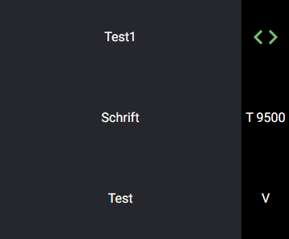

## Install

`npm i @nhochdrei/angular-swipe-list --save`

To bee able to use it, don't forget to import the `SwipeListModule` in your app.module.ts.

## Demo

[Stackblitz](https://stackblitz.com/edit/angular-swipe-list-demo)

## Use

For the basic setup you need the following html part and the typescript object:
```html 
<n3-swipe-list [data]="dataArray"></n3-swipe-list>
``` 
```typescript
dataArray: SwipelistData[] = [
	{
		label: 'test'
	},
	{
		label: 'test2'
	}
];
```

### Structure

The basic setup for a list without the displaying of the state consists of a list of swipe-cells. Each swipe-cell has a left, right and centre element. The middle element is the one which shows the label from the data object.

The left and right elements can be seen if you're swiping to one of the directions. In this case, the right element is placed right, you can see it if you're swiping to the left side.

This swipe-list is capable of an additional display of the actual state which your list element is in.
There is no limit to the number of states you can use, that's where the `defaultStartIndex` comes to life. For example, You want to use 3 different states, `delete`, `archive` and `spam`.
In our little example, the goal is a list where the user can select the needed operations on multiple elements. After the user selected all the operations she/he clicks a button and all the operations get executed.
To display the active state of each element we use the `options.hasStates` and set it to true. On every row, the standard state is set to `delete` for now. To change that just set the `defaultStartIndex` to 1. Now the standard state is `archive`, the counting starts from 0.

### The advanced version:
```html
<n3-swipe-list [data]="dataArray" [options]="options" (singleChangedData)="onOutput($event)">
```
States:
```typescript
statesToInsert: SwipelistState[] = [
    {
      value: 'X',
      color: 'rgb(50, 120, 180)',
      label: 'XMas'
    },
    {
      value: 'A',
      color: 'rgb(6, 182, 0)',
      label: 'automatic',
      matIcon: 'code',
      matIconStyling: 'color: rgb(120, 180, 120); font-size: 36px;'
    },
    {
      value: 'Y',
      color: 'rgb(80, 120, 120)',
      label: 'Y wing squadron',
      customIcon: '<span>T 9500</span>'
    }
  ];
```
Options:
```typescript
options: SwipelistOptions = {
    states: this.statesToInsert,
    statePanelWidth: '60px',
    stateFontSize: '12pt',
    colorCenter: 'rgb(37, 39, 44)',
    colorStatePanel: 'rgb(0, 0, 0)',
    colorText: 'white',
    borderRadius: '4px',
    height: '100px',
    listFontsize: '12pt',
    minSwipePercent: 30,
    maxSwipePx: 700
  };
```
Data:
```typescript
dataArray: SwipelistData[] = [
    {
      label: 'Test1',
      defaultStartIndex: 1
    },
    {
      label: 'Schrift',
      defaultStartIndex: 2
    },
    {
      label: 'Test',
      defaultStartIndex: 0
    }
  ];
```
Output:
```typescript
onOutput(event): void {
    const newData: SwipelistData = event;
    console.log(newData);
  }
```
`[data]` can be a two-way binding. You can use the `(dataChange)` event too, this event is triggered on every swipe. Your `data` object will update automatically on every swipe no matter if you're listing on the object or not.

```html
<n3-swipe-list
  [data]="dataArray"
  [options]="options"
  (dataChange)="onDataChange()"
  (singleChangedData)="onOutput($event)">
</n3-swipe-list>
```

### Data

The SwipelistData object has the following fields:
```typescript
SwipelistData {
    label: string;
    value?: string;
    defaultStartIndex?: number;
}
```
The only field you have to use to get the swipe-list run is the `label` one. This field represents the list element.
Each data object will have a value field, at least after the assigned swipe-cell got swiped. After every swipe, the `value` field will hold the state information. The state information is a custom assigned value or, depending on the direction of the swipe, `left` or `right`.

`defaultStartIndex`: An array index to set a default `value` from the states array if you got one

### Options

SwipelistOptions object:
``` typescript
SwipelistOptions {
    states?: SwipelistState[];
    displayStateValue?: boolean;
    hasStates?: boolean;
    statesAtLeft?: boolean;
    statePanelWidth?: string;
    stateFontSize?: string;
    colorCenter?: string;
    colorStatePanel?: string;
    useColorOfStates?: boolean;
    colorText?: string;
    borderRadius?: string;
    height?: string;
    listFontsize?: string;
    minSwipePercent?: number;
    maxSwipePx?: number;
}
```
>Each value has to be in a css readable format! For example `rgb(0,0,0)` or `20px`

`states`: An array of states

`displayStateValue`: If false no icons or values will be displayed in the status panel, this variable has a standard value of true

`hasStates`: If you want to display the actual state, this has to be true. You can set your own states anyways, they will get used

`statesAtLeft`: Only have to use this if you want this to be true

`statePanelWidth`: The width for your display of the active state

`stateFontSize`: Font-size of the states panel

`colorCenter`: The background-colour for the middle element

`colorStatePanel`: The background-colour for the display of the actual state

`useColorOfStates`: If true the status panel will have the background colour of the active state

`colorText`: Sets the text/font-colour for the complete list

`borderRadius`: If you want to, you can get rounded borders for the centre element. They only can be seen while swiping

`height`: The height for each of your list-elements

`listFontsize`: Font-size of the swipe-list

`minSwipePercent`: The needed percentage of the screen width to detect a swipe

`maxSwipePx`: This variable can be used to prevent a too long swipe on displays with too many pixels

### States

SwipelistState object:
```typescript
SwipelistState {
    value: string;
    color?: string;
    label?: string;
    matIcon?: string;
    matIconStyling?: string;
    customIcon?: string;
}
```
`value`: The value which will be displayed and set to your `data` object, don't leave this empty

`color`: The colour which will be displayed while swiping

`label`: The text which will be displayed while swiping

`matIcon`: If you use material icons just write the name of the icon down here - you can get the icons from [Material Icons](https://material.io/resources/icons/?style=baseline)

`matIconStyling`: This field can be used to further style the material icon, use full wrote out css statements like this: `color: rgb(120, 180, 120); font-size: 36px;`

`customIcon`: Use this if you want to use a none material design icon

>You should be able to use the material icons if you use `ng add @angular/material`. Otherwise look at [Material Icons Instructions](http://google.github.io/material-design-icons/)
